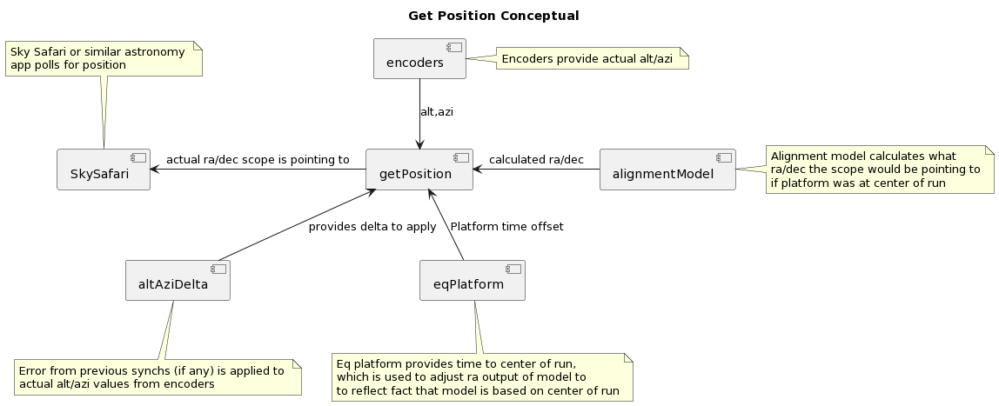

# The FrankenDob
## A 8" F6 Dobsonian on a dual axis Equatorial Platform with integrated Digital Setting Circles

Interesting stuff that it does:
- Micro controller (ESP32) controlled speed with a stepper motor, to cancel out tangent error
- Digital Setting Circles (encoders) on the alt/azi axis of my dobsonian are integrated with the platform, so I can always see on my ipad where I'm pointing in the sky
- A solid method of attaching the top of the platform to the drive system
- A separate base with (manual) fine rotation capability, to allow for easy leveling and polar alignment of the platform whilst in use (rather than kicking the platform)
- An autofocuser with hand controller, which also controls the platform axis motors
- ASCOM/Alpaca api for the focuser and platform, to allow synching/postion tracking/pulseguiding
- A "Zlomotion" style fine adjustment system for easily finding targets, with a really neat alt axis clutchable lead screw mechanism 

# Physical Design

The physical design consists of the following components:
* Platform
    * Base for polar alignment
        * Physical Structure (wooden disc)
        * Roller bearing so platform can rotate
        * Adjustable legs
        * Friction locking mechanism
        * Fine adjustment mechanism
    * Bottom layer
        * Stepper motor and drive system
        * Attachment point for top layer
        * ESP32 microcontroller and electonics
        * Power, control, and limit switches
        * Rollers for top layer
    * Top Layer
        * Vertical North Segments (actally south for me but everyone calls them VNS )
        * South Segment
        * Pivot and board for declination adjustment
        * Stepper and limit switch
* Focuser
    * Stepper and bracket
    * ESP32 and electronics
    * Case and mount
    * Wii Nunchuk
* ZloMotion
    * Alt Axis Fine Control
        * Steel rod
        * Top Attachment
        * Bottom Attachment
        * Clutchable lead screw
    * Azi Axis Fine Control
        * Belt system
        * Wooden scaffold
        * Bearings and pulleys
* Encoder System
    * Alt Encoder
    * Azi Encoder
    * ESP32 And electonics

## Equatorial Platform

### Base for polar alignment

The base of the platform is quite important if you are going to use the platform for astrophotography. Oddly I have not seen other designs that incorporate a separate rotatable base layer, but I consider it essential.

The basic problem the base solves is as follows: to track effectively the platform must be very close to perfectly level, and very accurately aligned along a true north/south axis. It is possible to achieve some degree of leveling using a spirit level or similar, and a rough north south alignment using a compass. However the sky itself is generally the final arbiter in these matters: the best way to check polar alignement is against the sky, preferably using a camera and some computer bases assistance such as Sharpcap's excellent polar alignement tool (which has an EQ platform option).

So the general procedure is to stack the platform, chuck the scope on top, and then check alignment. The issue comes when you find the alignment is slightly out. Changes to the level of the platform are possible through turning screw on the feet, however if you want to shift the axis of the platform by half a degree to the right it is very difficult due to the weight of the scope. I've read people talk about kicking the platform into alignment but somehow kicking and telescope should not be in the same sentence.

Therefore I added an extra layer to my platform that is essentially a lazy susan for the platform base. 

The base is built around a 600m wooden disc, with three pieces of wood screwed onto it with overhangs for the feet.
It has 6 vertical skate bearing in a circle (in 3d printed holders) that the platform base rolls over. Additionally it has 3 horizontal skate bearings around the edges holding the base in place. These have 3d printed covers on them to reduce "denting" of the wooden disc of the base, and to give some fine adjustment of the "tightness" (I printed these covers in various thicknesses).

One of these rollers has a rubber O ring slipped onto it for increased friction, and a small lever attached. This lever allows me to make very fine adjustments to the rotation of the whole stack when polar aligning.

A simple locking mechanism made out of a bike seat clamp allows me to lock and unlock rotation of the disk.

The feet are threaded through nuts that are epoxied onto the top and bottom of the overhanging wood. Small 3d printed knobs at the bottom of the feet give some degree of fine control for leveling of the base.

        
### Bottom layer

The bottom layer of the platform, like the base, is built around a 600mm wooden disc.

I chose to use a stepper motor to drive the platform. At first I tried to use a DC motor but the speed varied massively. One advantage of using a stepper is that you can very finely control the speed, and with a bit of math it is possible to correct for tangent error.

The stepper is mounted in a vibration free bracket, and power is transmitted to a drive shaft lead screw using a GT2 belt and pulleys. This fulfills a couple of functions: it gives a small gearing ratio (about 2x) making the stepper capable of finer movements, and it allowed me to place the stepper in the middle of the disc and route the belt under the north segments with millimeters of clearance.

The stepper drives a 2mm pitch lead screw, which drive a "shuttle" coupled with the top of the platform. The shuttle is built around a brass nut. To reduce slop in the lead screw system I added a steel hexagonal rail that runs paralell to the lead screw. The shuttle is bolted to a "truck" that runs along the rail: 6 skate bearings contrains degrees of movement and reduce wobble.

One of the key insights I had when building this part was that the angle of the point of attachment should be 90 degrees minus my latitude. This allowed me to design a means of attachment of top to bottom whereby I can slide the top of the platform onto the bottom, with two degrees of freedom for the top part (it slides forward and back, and has some small degree of play left and right). I experimented with other means of attachment but none of them are as steady as this one. 

Building the metal portion of the shuttle and truck was slightly challenging as the angles needed to be precise. I was able to 3d print a jig that allowed me to get very close.

The base has rollers (more skate bearings) that are precisely placed to support the curved segments of the top layer. To ensure precise placement of these components I printed flat jigs indicating where the screw hole needed to go: I felt that gave me more precision that simply measuring it out.

The base also contains a power switch, a battery (an 12v electric screwdriver battery), manual fast foward/rewind/play buttons (salvaged from an old fan), and a limit/home microswitch indicating the start of the run.

The whole thing is controlled by an ESP32 microcontroller, Bigtree TMC2209 "chopper" stepper drivers, and a stepdown voltage module so I can run the 3.3v EPS32 off of 12v. I also have a power regulator mostly so I can see how much charge my battery has left.

### Top Layer
The top layer provides a platform to securely hold the scope, has a stepper motor to add 5 degrees of rotation around the east/west platform axis, and holds the curved segments that allow the platform to smoothly track the RA axis.

The top layer began life as a 600mm disc similar to the other two. However when I added a second axis I needed the change the shape, partly because I wanted a long lever arm to decrease the load on the declination stepper motor, and partly because I needed to get the stepper motor and lead screw away from the rotation footprint of the dobsonian.

So the top layer is made of two hinged pieces of form ply, separated by a 30mm baton. The wooden pieces are braced with steel whereever possible, which reduces flex but also lowers the center of gravity of the scope when it is resting on the platform. Toppling is a real risk with equatorial platforms: when I first started designing I calcualted the center of gravity of my scope, however over time I've added more weight to the scope (stepper motor, camera) as well as adding a few more degrees of potential tilt due to the declination axis. I test for topple by running the platform to it's extremes limits, then turning the scope to maximise imbalance.

The Vertical Sorth Segments and North Segments provice a smooth curve for the platform to track the RA axis. I designed specifically for my latitude, and 3d printed them (100% infill!). 3d printed parts are very solid under compression forces, and shear forces are minimised to the mounting points. I added aluminium tracks that follow the curve of the plastic: these track (simple strips of aluminum) provide the contact point with the skate bearings of the bottom layer, and prevent the plastic from wearing over time.

Again, when placing these segments I printed jigs to precisely position them.

The 2nd axis is implemented as a simple hinge, held together by bolts rather than screws. The hinge is driven at one end by a stepper motor with a 19:1 gearbox. I considered various more complex drive mechanism but ended up settling on something quite simple: the stepper is attached the the bottom board with a bracket, and drives a lead screw directly up into a brass nut attached to the top board. This means that all of the load (ie the weight of the scope) drives directly down through the axis of the stepper gearbox, which may be a terrible idea but seems to be fine thus far. 

Ideally there would be some degree of freedom of movment within the stepper/lead screw system: as the system opens and closes the point of contact with the nut should shift (towards/away from the hinge) by around 3mm-4mm across the 5 degree range. I chose not to build a mechanism to allow for the shift, and instead rely on flex in the nut attachment, stepper bracket, and lead screw coupler to adjust the angles to compensate. This is not ideal as I can hear some degree of resistance at the extreme ends of the range: however primary purpose of the second axis is to allow for pulseguided declination axis error corrections, and therefore it is unlikely to spend a lot of time operating in those regions.

Similar to the ra axis I have a limit switch so that the axis can be homed. I actually use pretty much the same code to drive this axis as the ra axis, including the code that compensates for tangent error. 

## Focuser
One of the things I learned quite quickly was that after a target is aquired and is sitting dead center of the view, touching the scope in any way (including turning the focuser) tends to shift the view, no matter how careful you are. I therefore built an stepper driver focuser , with attached wii nunchuk controller for manual control.

There are a number of projects out there that are similar to this, but I wanted some degree of integration with other components of the platform, so I coded from scratch.

After some math and testing, I settled on a 200 step stepper with a 19:1 gearbox, as I estimated that this would give me the right number of stepper steps in the prime focus zone of my scope. The stepper is heavier than I would like: if I was doing this again I'd probably try and save a few hundred grams here as the stepper sits on the far end of the lever that is the dobsonian tube, requireing more counterbalance weights at the far end of the tube, more weight total for the platform to drive, and more flexure through the scope system.

Mounting the stepper and electonics to the case was challenging. I had a couple of contraints: I didn't want to drill any holes in my telescope, and I didn't want to run a cable from the dobsonian base directly into the motor. My concern with the last point was that disconnecting a powered stepper motor (either by accidently yanking a cable out or by forgetting to power off before dissassemling ) will kill the stepper driver board, therefore I chose to place the electonics next to the stepper itself and just run power for the whole thing up the tube.

The electronics consist of an ESP32, a Big Easy Driver control board (this was before I discovered the joy of chopper drivers), and a power stepdown module to step the 12v motor current down to 3.3v for the ESP32. In addition I added a small LED module I salvaged from an old electric screwdriver.

The case and mount for the stepper is probably the most complex part I designed and printed. The scope has some existing screw holes at the tip, and some bolts that hold the focuser tube in position. I modeled the scope to get the postion of each of these existing hole (which took a LOT of test prints as none of this is simple planar modeling), and thus was able to design a curved part that tapped into the existing holes. For extra complexity I mounted each of the three component boards (ESP32, Big Easy Driver board, and voltage stepdown) on their own planes, to hug the scope as much as possible and keep the profile low.

I attached a wii nunchuk to control the focuser manually, for visual observing. These are kinda neat as they have two buttons, a joystick, and acceleromters (which I don't use) in a small package. I added a small salvaged 4 LED strip to give me some feedback of state, as I wrote a fairly complex UI control for the nunchuk.

Moving the nunchuk joystick up and down will drive the focuser in and out. The nunchuk can drive the stepper at four different speeds. The LED indicates which speed the focuser is set at: the first LED is fastest, the last slowest. Holding the "Z" button down and pushing the stick into a cardinal direction changes the speeed.

I consdered added a limit switch to the focuser but settled on a manual limit setting. Holding both "Z" and "C" puts the focuser into limit finding mode, then the focuser is moved to the limit and the buttons released.

Holding the "C" button only lets the nunchuk drive the equatorial plaform. This is done by send JSON commands over UDP to the platform base.

In addition the the manual control, I also implemented a good subset of the ASCOM Alpaca API. This allows software on my computer to discover the focuser, and the run auto focuser routines in conjunction with a camera. I use a 3d printed bantinov mast to assist with this.

I found that sky safari on ipad does not play well with multiple devices on a network both responding to alpaca discovery requests. This may be the way I've implemented discovery but I suspect it is a sharpcap bug. To work around this I put a "cheat code" where the focuser will not respond to alpaca discovery requests as long as the "Z" button is held down.

## ZloMotion

One of the advantages of a dobsonian scope is the ease of movement that it provides. It's easy to grab the scope and slew it to a new target. However once I put a camera into the scope I struggled with fine control: getting a target centered (even when my Digital Setting Circles would tell me just where I am pointing) was quite a challenge. Veteran dobsonian users talk about careful nudging to get targets into the center of view, however my fine motor skills are not up to this taks.

One option to solve this is to make the whole scope a dobsonian Goto by putting steppers on the alt and azi axis. However then (without a complex clutch system) you lose the freedom to manually slew the scope around.

I came across the ZloMotion system in my reading. ZloMotion was a briefly produced commercial product for fine control of dobsonian alt and azi axis. Several people have reimplemented similar systems, so I had a go at that.

For the azimuth axis I went with a fairly common design involving a v belt around the whole of the scope, with a wooden scaffold offset from the scope holding a pulley and handle, a long 1/2" threaded rod, and  3D printed parts holding a moderately complex array of bearings. At one point I had a brake system in place on this axis, but I removed it as I could not get it to lock as cleanly as I would like. I also attached the azimuth encoder to this axis as the ratio of the wheel gave me some extra accuracy.

For the altitude axis I was not happy with any of the existing zlomotion style designs that I saw. Most of these used some form of telescoping rod, however for my scope I could not find dimensions that worked for me. Therefore I designed what I think is a new solution to this problem. I noticed that a rod attached to the top of the scope would have just enough space to fit inside the dob frame when the scope was vertical, and if given a pivot point halfway up the dob frame this rod would have enough space to hand under the scope when the scope was horizontal.

If that pivot point was also some form of screw, the elevation of the scope could be finely controlled by turning the screw. However I didn't want to lose the ability to freely slew the scope up and down, so I needed some form of mechanism that acted like a lead screw half the time and allowed free sliding the other half.

I spend some time hunting for such a mechanism and wasn't able to find one. I then found a simple design for a skate bearing lead screw: three skate bearings evenly placed around a smoooth metal rod, each bearing being slightly tilted. Such a device acts like a lead screw.

I printed a couple of those and experimented. Eventually I was able to come up with a design where two of the bearings clamp together driven by a spring.

 However for the 

### Alt Axis Fine Control
        * Steel rod
        * Top Attachment
        * Bottom Attachment
        * Clutchable lead screw
### Azi Axis Fine Control
        * Belt system
        * Wooden scaffold
        * Bearings and pulleys
## Encoder System
    * Alt Encoder
    * Azi Encoder
    * ESP32 And electonics

# Digital Setting Circles Logic

The sky is a big plce. Digital Setting Circles make it easy to find targets. Essentially you have a device running an astronomy app (I use Sky Safari on an ipad) which constantly asks the scope where it is pointing. The scope has an awareness of its own physical state (from encoders and stepper motors) and is able to return a position constantly to the ipad.

The logic of how the telescope knows where it is pointing is somewhat complex. "Where it is pointing" is defined as Right Ascension/Declination (ra/dec) coordinates. This is the fixed sphere of the sky (that seems to rotate from the view of a terrestial observer)

Each axis of the dobsonian telescope has an encoder attached to it. These two encoders can be interrogated to get the altitude and azimuth of the dobsonian mount.

If a dobsonian scope is sitting perfectly level at some point on earth, it is possible to perform a mapping from these altitude and azimuth coordinates to ra and dec, if the latitude, longitude, and local time are known.

Further, it is possible to ignore latitude, longitude, and local time altogether by doing a 2 or 3 star alignment, as defined in Taki Toshimi's amazing 1989 paper ["A New Concept in Computer-Aided Telescopes"](http://takitoshimi.starfree.jp/matrix/matrix\_method\_rev\_e.pdf]). This builds an alignment model using two pairs of alt/azi, ra/dec coords. This model can then be used to map alt/azi to ra/dec (or vice versa).  I borrowed parts of the code for this from [TeenAstro](https://github.com/charleslemaire0/TeenAstro).

The situation becomes somewhat more complicated when we place our dob on a (hopefully perfectly polar aligned) equatorial platform. Now the whole system can be rotated by an arbitary distance about the axis through the celestial pole. I found the simplest way to think about this was to build an aligment model for the situation where the platform is centered, and then treat the known offset from the center point as an offset for the ra value. 

I.E.: if the platform is well aligned, and the alt/azi position of the dobsonian does not change, running the platform along its track changes only the ra component of the target.

We get more complexity due to the passage of time: as time passes the ra component of targets changes, and this needs to be dealt with both when building the model and when interrogating it.

Then we add the dec axis to the mix. Whilst initially one might think at the second axis causes the platform to act like a classic german equatorial mount, this is not the case. If the scope is pointing directly north or south, driving the dec axis motor results in a direct dec change only. However if the scope is pointing at the eastern or western horizon, driving the dec axis keeps the target stationary but rotates the field of view around it! This is a limitation of 2 axis platforms, but not a severe one.

Thus: we need to apply a new rotation to the coordinate system for changes in the dec axis. All of these changes need to be applied when building the model, when getting a position, and when slewing to a target.

Lastly: nothing in this world is perfect. Polar alignments can be slightly off, right angles in telescope mounts can be not quite right angles, encoders can drop steps, steppers can have poor tolerances. My engineering is OK but at the end of the day I'm working with wood, steel, and plastic in my garage :) : Stuff is going to drift. 

So I added the ability in code to cater for this error: once I create a 2 star alignment model (which I do by pointing in two different directions and platesolving camera images), I push the scope to the rough vicinity of my target. Once I get close, I platesolve again. Invariably there is some small difference between the platesolved (actual) ra/dec and then modelled ra/dec. The scope takes this difference and applies it as an offset to all future readouts. This error probably only applies in one small section of the sky: however once I choose a new target I platesolve again and get a different error correction. This hybrid approach works very well.

Below is a high level conceptual summary of how this works, as well as a slightly more details sequence diagram.

# Why did you do this? 

Around 2018 I rescued an 6" Dobsonian telescope from an abusive environment. The scope has been stored outside for some period of time, but structurally was pretty sound. It was my first telescope and I fond it a joy to use.

However I quickly found the limitations of my purchase. I live on the (bortle 5) southern edges of Sydney: planetary and luna observing was amazing, but I wanted to see the wonders of faint deep space wispies: nebulae and galaxies. From my observing location, with my scope, this proved challenging.

If I zoomed in on an object too far, it drifted out of view. If an object was too faint, I couldn't find it, and when I could find it it was too faint to see. Much frustration ensued. 

Sometime around 2020 I started building an equatorial platform to address drifting. I also started looking at digital setting circles to help me understand where I am looking in the sky. And, after I purchased the cheapest dedicated astro camera I could buy (the ZWO ASI224MC), I decided I needed an electronic focuser and a ZloMotion style fine adjustment system.

With lots of time, design, and a lot of 3d printing, my Frankendob was born (though it is still a work in progress).

# Wait. What's an Equatorial Platform?

An equatorial platform is a platform that cancels out the rotation of the earth for some period of time. This is slightly harder than it sounds: mechanically you need a platform that rotates around a pivot line that points to the North celestial pole (or South celestial pole if you are in the southern hemisphere). Any telescope sitting on such a platform remains stationary relative to the sky, for a period of time, but only if the platform is accurately aligned, level, and rotates at the exact speed the earth is turning at.

My platform is designed for my latitude (~33.8S): the supports the roller run on parts are 3d printed specifically for this latitude. Working out the shapes of those curves was the hardest part of the design: my Fusion 360 design began with an overly complex 3d sketch mapping out the shape of the curves, and then I built the rest of the platform around it.

[Equatorial Platform Code](https://github.com/jacrify/FrankenDobEquatorialPlatform)

[Auto Focuser Code](https://github.com/jacrify/FrankenDobFocuser)

[Digital Setting Circles Code](https://github.com/jacrify/FrankenDobDSC)

[Platform Wiring](docs/diagrams/src/EQPlatformWiring.pdf)
