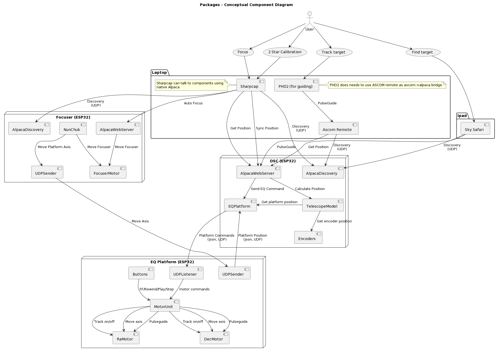

# The FrankenDob
## A 8" F6 Dobsonian on a dual axis Equatorial Platform with integrated Digital Setting Circles

Interesting stuff that it does:
- Micro controller (ESP32) controlled speed with a stepper motor, to cancel out tangent error
- Digital Setting Circles (encoders) on the alt/azi axis of my dobsonian are integrated with the platform, so I can always see on my ipad where I'm pointing in the sky
- A new method of attaching the top of the platform to the drive system
- A separate base with rotation capability, to allow for easy leveling and polar alignment of the platform whilst in use (rather than kicking it)
- An autofocuser with hand controller, which also controls the platform axis
- ASCOM/Alpaca api for the focuser and platform, to allow synching/postion tracking/pulseguiding
- A "Zlomotion" style fine adjustment system for easily finding targets, with a really neat alt axis clutchable lead screw mechanism 

# Digital Setting Circles Logic

The sky is a big plce. Digital Setting Circles make it easy to find targets. Essentially you have a device running an astronomy app (I use Sky Safari on an ipad) which constantly asks the scope where it is pointing. The scope has an awareness of its own physical state (from encoders and stepper motors) and is able to return a position constantly to the ipad.

The logic of how the telescope knows where it is pointing is somewhat complex. "Where it is pointing" is defined as Right Ascension/Declination (ra/dec) coordinates. This is the fixed sphere of the sky (that seems to rotate from the view of a terrestial observer)

Each axis of the dobsonian telescope has an encoder attached to it. These two encoders can be interrogated to get the altitude and azimuth of the dobsonian mount.

If a dobsonian scope is sitting perfectly level at some point on earth, it is possible to perform a mapping from these altitude and azimuth coordinates to ra and dec, if the latitude, longitude, and local time are known.

Further, it is possible to ignore latitude, longitude, and local time altogether by doing a 2 or 3 star alignment, as defined in Taki Toshimi's amazing 1989 paper ["A New Concept in Computer-Aided Telescopes"](http://takitoshimi.starfree.jp/matrix/matrix\_method\_rev\_e.pdf]). This builds an alignment model using two pairs of alt/azi, ra/dec coords. This model can then be used to map alt/azi to ra/dec (or vice versa).  I borrowed parts of the code for this from [TeenAstro](https://github.com/charleslemaire0/TeenAstro).

The situation becomes somewhat more complicated when we place our dob on a (hopefully perfectly polar aligned) equatorial platform. Now the whole system can be rotated by an arbitary distance about the axis through the celestial pole. I found the simplest way to think about this was to build an aligment model for the situation where the platform is centered, and the treat the known offset from the center point as an offset for the ra value. 

Ie if the platform is well aligned, and the alt/azi position of the dobsonian does not change, running the platform along it's track changes only the ra component of the target.

We get more complexity due to the passage of time, both in building the model and subsequently. As time passes the ra component of targets changes.

Then we add the dec axis to the mix. Whilst initially one might think at the second axis causes the platform to act like a classic german equatorial mount, this is not the case. If the scope is pointing directly north or south, driving the dec axis motor results in a direct dec change only. However if the scope is pointing at the eastern or western horizon, driving the dec axis keeps the target stationary but rotates the field of view around it!

Thus: we need to apply a new rotation to the coorinate system for changes in the dec axis. All of these changes need to be applied when building the model, when getting a position, and when slewing to a target.

Lastly: nothing in this world is perfect. Polar alignments can be slightly off, right angles in telescope mounts can be not quite right angles, encoders can drop steps, steppers can have poor tolerances. My engineering is OK but at the end of the day I'm working with wood, steel, and plastic in my garage :) stuff is going to drift. 

So I added the ability in my code to cater for this error: once I create a 2 star alignment model (which I do by pointing in two different directions and platesolving camera images), I push the scope to the rough vicinity of my target. Once I get close, I platesolve again. Invariably there is some small difference between the platesolved (actual) ra/dec and then modelled ra/dec. The scope takes this difference and applies it as an offset to all future readouts. This error probably only applies in one small section of the sky: however once I choose a new target I platesolve again and get a different error correction. This hybrid approach works very well.

Essentially the user performs a couple of ASCOM "SyncToCoords" operations (I do this using Sharpcap platesolves) which give the scope the exact ra/dec it is pointing at.

Below is a high level conceptual summary of how this works, as well as a slightly more details sequence diagram.

# Why did you do this? Justify your actions please

Around 2018 I rescued an 6" Dobsonian telescope from an abusive environment. The scope has been stored outside for some period of time, but structurally was pretty sound. It was my first telescope and I fond it a joy to use.

However I quickly found the limitations of my purchase. I live on the (bortle 5) southern edges of Sydney: planetary and luna observing was amazing, but I wanted to see the wonders of faint deep space wispies: nebulae and galaxies. From my observing location, with my scope, this proved challenging.

If I zoomed in on an object too far, it drifted out of view. If an object was too faint, I couldn't find it, and when I could find it it was too faint to see. Much frustration ensued. 

Sometime around 2020 I started building an equatorial platform to address drifting. I also started looking at digital setting circles to help me understand where I am looking in the sky. And, after I purchased the cheapest dedicated astro camera I could buy (the ZWO ASI224MC), I decided I needed an electronic focuser and a ZloMotion style fine adjustment system.

With lots of time, design, and a lot of 3d printing, my Frankendob was born. I'll break down the various components below.

# Wait. What's an Equatorial Platform?

An equatorial platform is a platform that cancels out the rotation of the earth for some period of time. This is slightly harder than it sounds: mechanically you need a platform that rotates around a pivot line that points to the North celestial pole (or South celestial pole if you are in the southern hemisphere). Any telescope sitting on such a platform remains stationary relative to the sky, for a period of time, but only if the platform is accurately aligned, level, and rotates at the exact speed the earth is turning at.

My platform is designed for my latitude (~33.8S): the supports the roller run on parts are 3d printed specifically for this latitude. Working out the shapes of those curves was the hardest part of the design: my Fusion 360 design began with an overly complex 3d sketch mapping out the shape of the curves, and then I built the rest of the platform around it.

# And what's a "dual axis"?

A single axis platform is fine for visual observing (to keep an object from drifting out of view). However if you trying to do any form of astrophotography, you start trying to maximise the 

[Equatorial Platform Code](https://github.com/jacrify/FrankenDobEquatorialPlatform)

[Auto Focuser Code](https://github.com/jacrify/FrankenDobFocuser)

[Digital Setting Circles Code](https://github.com/jacrify/FrankenDobDSC)

[Platform Wiring](docs/diagrams/src/EQPlatformWiring.pdf)
